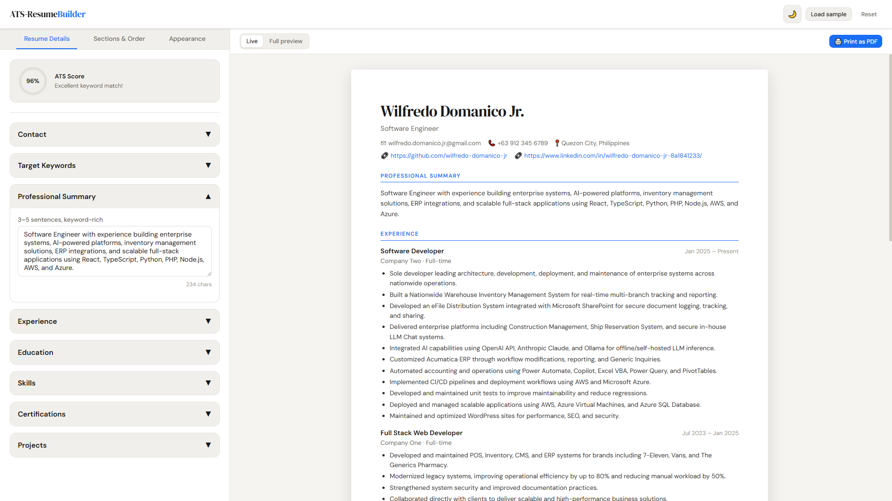

# 📄 ATS Resume Builder

[](https://react.dev/)
[](https://vitejs.dev/)
[](https://www.typescriptlang.org/)
[](https://developer.mozilla.org/en-US/docs/Web/CSS)
[](LICENSE)

---

## 📌 Project Description

**ATS Resume Builder** is a modern, client-side resume creation tool built with **React and Vite**.

It allows users to build professional, ATS-friendly resumes in real time with a live preview system — **no backend, no database, and no external APIs required**.

The app is designed to help users structure their resumes in a clean format optimized for Applicant Tracking Systems (ATS).

---

## ⚡ Features

- 🧾 Real-time resume form editor
- 👀 Live preview of resume output
- 📱 Responsive UI (desktop + mobile toggle view)
- 🧭 Section navigation (Contact, Experience, Skills, etc.)
- ✏️ Editable structured inputs
- 💾 Client-side only (no data upload)
- 🎨 Clean UI using plain CSS design system
- ⚡ Fast performance with Vite

---

## 📸 Screenshot

<p align="center">
  
</p>

---

## 🧠 How It Works

1. User fills out structured resume form (Contact, Experience, Skills, etc.)
2. Data is stored in React state (no backend required)
3. Live preview updates instantly as user types
4. Sections can be navigated using section sidebar / mobile tabs
5. Final resume is displayed in ATS-friendly layout

---

## 🚀 Getting Started

### 📁 Clone the repository

```bash id="clone1"
git clone https://github.com/wilfredo-domanico-jr/ats-resume-builder.git
cd ats-resume-builder
```

---

### 📦 Install dependencies

```bash id="install1"
npm install
```

---

### ▶️ Run development server

```bash id="dev1"
npm run dev
```

---

### 🏗️ Build for production

```bash id="build1"
npm run build
```

---

### 👀 Preview production build

```bash id="preview1"
npm run preview
```

---

## 🧰 Tech Stack

- React 19
- Vite
- JavaScript (ES6+)
- Plain CSS (custom design system)
- React Hooks (useState, useEffect)
- Component-based architecture

---

## 📈 Use Cases

- Build professional ATS-friendly resumes
- Practice frontend form handling in React
- Demonstrate component-based UI design
- Portfolio project for frontend development
- Learn state-driven UI architecture

---

## 🧠 Key Learning Highlights

- Component-based architecture in React
- State management using hooks
- Dynamic UI rendering
- Responsive design with plain CSS
- Sticky layouts and navigation systems
- UI/UX structuring for form-heavy applications

---

## 📄 License

This project is licensed under the [MIT License](LICENSE).

---

## ⭐ Acknowledgements

Built with modern frontend practices to simulate a real-world resume builder focused on usability, structure, and ATS compatibility.
